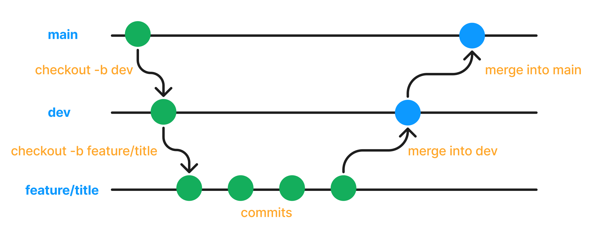

# Redo

본 프로젝트는 **GPT에게 기록한 메모를 복습하고 정리할 수 있는 서비스**입니다.
오랫동안 기록해 메모가 쌓이면 특정 개념을 어디에 기록했는지 찾기 어려워집니다.

**‘Redo’가 제공하는 퀴즈**와 함께하면 문제없이 모든 기록을 복습 받을 수 있습니다.
이 ‘Redo’ 서비스는 **Computer Science에 특화**되어 있으며 관련 학문을 학습하는 이들에게 큰 도움이 될 것입니다.

---

## 커밋 규칙

| 커밋 주제    | 내용                                                       |
| ------------ | ---------------------------------------------------------- |
| **feat**     | **새로운 기능 구현 EX: 로그인 페이지, CRUD 기능**          |
| **update**   | **기존 기능 업데이트 EX: UI 변경, gpt 프롬프트 수정**      |
| **fix**      | **버그 수정**                                              |
| **refactor** | **프로젝트 폴더 구조 정리 및 코드 개선(가독성, 유지보수)** |
| **docs**     | **문서화**                                                 |
| **config**   | **패키지 관리, 설정 파일, 기술 연동(DB 등)**               |

다음 형식의 커밋 메시지를 권장드립니다.

> [분야] 커밋 주제: 내용

```

EX)
[client] feat: 로그인 페이지 UI
[client] fix: 로그아웃 시 토큰 초기화
[server] feat: 메모 CRUD
[server] config: DB 관련 패키지 추가
[project] docs: README 수정
```

`분야`는 간단하게 프론트(`client`), 서버(`server`), 프로젝트 전체(**`project`**)로 구분하고자 합니다.

## 브랜치 규칙

| 종류                  | 용도                                                                                                               |
| --------------------- | ------------------------------------------------------------------------------------------------------------------ |
| **main**              | **배포용 - 배포 툴이 이 브랜치의 커밋 변경 상태를 감지해 자동 배포할 수 있게합니다.**                              |
| **dev**               | **코드 통합 - 프론트와 서버 기능을 취합할 브랜치입니다.**                                                          |
| **feature/기능 이름** | **기능 개발 - 각자가 맡은 기능을 개발할 브랜치입니다. 추후, dev에 merge하고 삭제하는 방식으로 사용하고자 합니다.** |

### 개발 과정



#### 1. feature 브랜치 생성

```bash
git checkout -b feature/[기능 이름]

EX:
git checkout -b feature/login-ui
git checkout -b feature/memo-crud
```

**`git checkout -b`** 로 원하는 이름의 브랜치를 만든 후 이동합니다.

#### 2. 개발

로컬에서 기능을 구현합니다.

❗위의 커밋 규칙에 맞는 커밋 메시지를 따라주시면 감사하겠습니다.

❗**하나의 커밋에 너무 많은 기능이 구성되지 않도록** 적절히 나누어 커밋하는 것을 권장합니다.

#### 3. Pull Request 생성

Github 페이지에 들어와 `Pull Request`를 생성합니다.

만약, *브랜치 충돌이 발생한다면 해결*한 후 커밋합니다.

❗현재 작업하는 브랜치의 **커밋이 최신이 되도록 Pull, Push를 잊지 말아주세요!**

#### 4. Merge 진행(dev, main)

`feature` 브랜치는 `dev`에 merge합니다.

`dev` 브랜치에서 기능 상 문제가 없다면 `main`에 merge합니다.

#### 5. Pull 진행

로컬에서도 merge된 결과를 Pull해줍니다.

```bash
git pull origin main
```

#### 1 ~ 5 반복하며 진행
